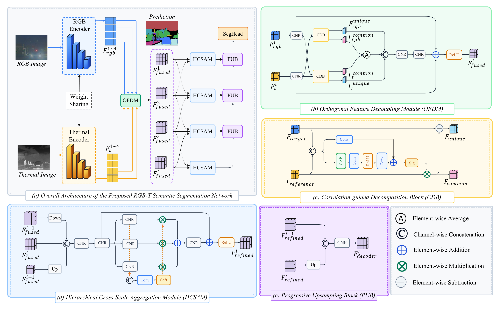

# ODCANet

Official PyTorch implementation of **ODCANet**: *Orthogonal Feature Decoupling and Hierarchical Cross-Scale Aggregation Network for RGB-T Semantic Segmentation*.

ODCANet uses a weight-sharing ConvNeXtV2 encoder to extract aligned RGB and thermal features, then applies an Orthogonal Feature Decoupling Module (OFDM) with a Correlation-guided Decomposition Block (CDB) to encourage separation of modality-shared and modality-specific representations. A Hierarchical Cross-Scale Aggregation Module (HCSAM) further aggregates multi-scale fused features for dense prediction.

<p align="center">
  
</p>
<p align="center"><em>Overview of ODCANet. (a) Overall pipeline. (b) OFDM. (c) CDB. (d) HCSAM. (e) PUB.</em></p>

## Project Structure

```text
ODCANet/
├── train.py                     # Training entry
├── test.py                      # Evaluation entry
├── requirements.txt             # Dependencies
├── config/
│   └── train_cfg.yaml           # Training / model config
├── data/
│   ├── mfnet_dataset.py         # MFNet loader
│   └── rgbt_dataset.py          # PST / FMB loaders
├── model/
│   ├── build_model.py           # Build full ODCANet
│   ├── shared_encoder.py        # Shared ConvNeXtV2 encoder
│   ├── ofdm.py                  # OFDM
│   └── hcsam.py                 # HCSAM decoder
├── evaluation/
│   ├── metrics.py               # mIoU / mAcc
│   └── roc.py                   # ROC / AUC
├── utils/
│   ├── checkpoint.py            # Save / load weights
│   ├── inference.py             # Inference helpers
│   ├── visualization.py         # Visualization helpers
│   └── analyze_decoupling.py    # Feature-decoupling analysis
├── Checkpoint/                  # Pretrained weights
│   ├── MFNet/
│   ├── PST/
│   └── FMB/
└── docs/
    └── network.png              # Architecture figure
```

## Environment

The code has been tested with **Python 3.10**, **PyTorch 2.10.0**, **torchvision 0.25.0**, and **CUDA 12.x**. Create a Python environment and install PyTorch / torchvision according to your CUDA version:

```bash
conda create -n odcanet python=3.10 -y
conda activate odcanet

# Install PyTorch / torchvision following your CUDA version:
# https://pytorch.org/get-started/locally/

git clone https://github.com/honvvi/ODCANet.git
cd ODCANet
pip install -r requirements.txt
```

The code uses CUDA by default. Set `--device` in the training / evaluation commands below.

## Pretrained Weights

Dataset-specific trained weights will be released on the [GitHub Releases](https://github.com/honvvi/ODCANet/releases) page. For each dataset, download and place **three** component files under `Checkpoint/<dataset>/`:

```text
Checkpoint/
├── MFNet/
│   ├── shared_encoder.pth
│   ├── ofdm.pth
│   └── hcsam_decoder.pth
├── PST/
└── FMB/    
```

Use `MFNet`, `PST`, or `FMB` as the folder name to match `--dataset`. During training, ConvNeXtV2-Base (ImageNet-22K) is loaded automatically when `Model.Shared_Encoder.pretrain: True` in `config/train_cfg.yaml`.

## Datasets

Set `--data_root` to the parent directory of the datasets below. `--dataset` is one of `MFNet`, `PST`, `FMB`. Download: [MFNet](https://www.mi.t.u-tokyo.ac.jp/static/projects/mil_multispectral/), [PST900](https://drive.google.com/file/d/1hZeM-MvdUC_Btyok7mdF00RV-InbAadm/view?pli=1), [FMB](https://pan.baidu.com/s/1k7PgCsSJVZJIoIhgMjWxNg?pwd=IVIF).

```text
<data_root>/
├── MFNet/
│   ├── images/              # 4-channel PNG (RGB + thermal)
│   ├── labels/              # Class-index masks
│   ├── train.txt
│   └── test.txt
├── PST/                     # PST900
│   ├── train/
│   │   ├── rgb/
│   │   ├── thermal/
│   │   └── labels/
│   └── test/
│       ├── rgb/
│       ├── thermal/
│       └── labels/
└── FMB/
    ├── train/
    │   ├── Visible/
    │   ├── Infrared/
    │   └── Label/
    └── test/
        ├── Visible/
        ├── Infrared/
        └── Label/
```

## Training

```bash
python train.py \
  --config ./config/train_cfg.yaml \
  --dataset MFNet \
  --data_root /path/to/datasets \
  --device cuda:0
```

- Replace `MFNet` with `PST` or `FMB`.
- For PST900, use `--batch_size 1` if GPU memory is limited.
- Default schedule: 300 epochs, AdamW, ImageNet normalization, random flip + multi-scale resize (`{0.5, 0.75, 1.0, 1.25, 1.5, 1.75}`) + crop/pad.
- The final-epoch component weights are saved to `Checkpoint/<dataset>/`.

## Evaluation

```bash
python test.py \
  --config ./config/train_cfg.yaml \
  --dataset MFNet \
  --data_root /path/to/datasets \
  --shared_encoder_path ./Checkpoint/MFNet/shared_encoder.pth \
  --ofdm_path ./Checkpoint/MFNet/ofdm.pth \
  --hcsam_decoder_path ./Checkpoint/MFNet/hcsam_decoder.pth \
  --device cuda:0
```

For each selected dataset, the script will:

1. Load the three component weights under `Checkpoint/<dataset>/`.
2. Run inference on the official test split.
3. Report pixel accuracy, mean accuracy, mIoU, per-class IoU / accuracy, ROC/AUC, and efficiency metrics.
4. Save numerical summaries under `results/<dataset>/`.

## Feature Decoupling Analysis

```bash
python utils/analyze_decoupling.py \
  --dataset MFNet \
  --data_root /path/to/datasets \
  --config ./config/train_cfg.yaml \
  --device cuda:0 \
  --run "lambda=0:/path/shared_encoder.pth:/path/ofdm_lambda0.pth:/path/decoder.pth" \
  --run "lambda=0.01:/path/shared_encoder.pth:/path/ofdm_lambda001.pth:/path/decoder.pth" \
  --reference lambda=0 \
  --compute-cka
```

## Citation

If you find this repository useful, please cite the corresponding paper.